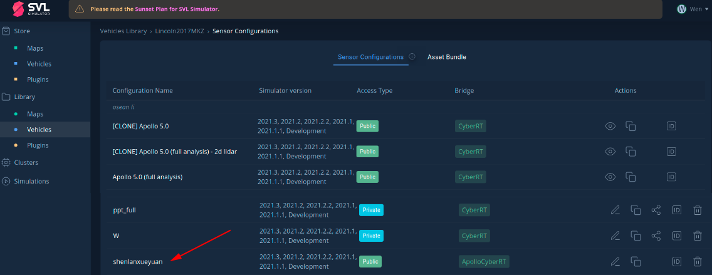
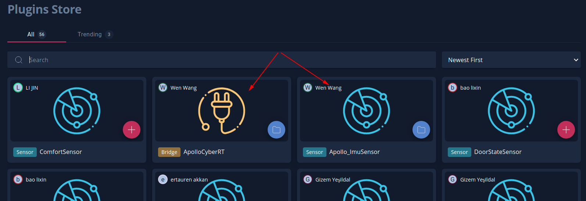

# ShenLanSVL


针对`Apollo5.0`及以上的版本，修复`LGSVL`隐含bug, 添加满足`Apollo`需求的传感器`Apollo_IMUsensor`，以及桥接通信插件`ApolloCyberRT`，对LGSVL源代码重新编译，生成符合`Apollo`的可执行文件，在ubuntu18.04, Win11系统上均通过测试。

#### 下载

```shell
git clone https://github.com/shenlan2017/ShenLanSVL.git
```

#### 启动

终端运行SVL`./simulator`或直接双击即可启动仿真

```bash
cd ShenLanSVL/Lgsvl_Linux && ./simulator
```

#### 仿真传感器配置

针对深蓝配套课程，这里采用深蓝发布在Lgsvl中的Lincon2017MKZ传感器配置环境`shenlanxueyuan`



将深蓝发布在LGSVL的plugins Store中，将`ApolloCyberRT` 和`Apollo_ImuSensor`添加至自己的仓库中，即可在深蓝发布的svl中进行使用。		



有关更多Lgsvl的参考文档，可访问

1. https://www.svlsimulator.com/docs/
2. https://www.youtube.com/c/LGSVLSimulator
3. https://space.bilibili.com/412295691?spm_id_from=333.337.search-card.all.click


